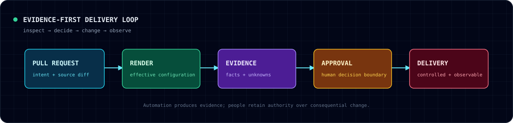

<h1 align="center">(@heyimusa)</h1>

  <strong>Infrastructure & DevOps Engineer</strong> 
  Building evidence-first delivery systems: safer to change, easier to explain,
  and less surprising at 03:00.

  <a href="https://heyimusa.blog">Writing</a> ·
  <a href="https://heyimusa.blog/portfolio/">Portfolio</a> ·
  <a href="https://www.linkedin.com/in/heyimusa/">LinkedIn</a>

  

---

> [!TIP]
> **Current thesis**
>
> A deployment should be reviewable before it is runnable.
> A recovery claim should be backed by evidence, not confidence.

## Public tools

| Tool | Question it answers |
|---|---|
| [`kube-blast-radius`](https://github.com/heyimusa/kube-blast-radius) | *What new security capability or network surface did this Kubernetes change introduce?* |
| [`ci-capsule`](https://github.com/heyimusa/ci-capsule) | *What evidence did a failed GitHub Actions run actually leave behind—and is a replay candidate provable?* |
| [`delivery-evidence`](https://github.com/heyimusa/delivery-evidence) | *Does a delivery workflow and its rendered manifest declare a reviewable deployment, readiness, and rollback boundary?* |
| [`probe-contract`](https://github.com/heyimusa/probe-contract) | *Does a Docker Compose healthcheck agree with the health contract the service claims to have?* |

> [!NOTE]
> **Working principles**
>
> - Prefer static, reviewable evidence to optimistic automation.
> - Treat ambiguity as `unknown`, never as a passing result.
> - Separate inspection from mutation; preserve explicit approval boundaries.
> - Build tools with deterministic output and useful failure modes.

## Lab notes

I write evidence-led, Docker-tested notes on
[heyimusa.blog](https://heyimusa.blog):

- [An agent needs an evidence bundle, not a confident answer](https://heyimusa.blog/an-agent-needs-an-evidence-bundle)
- [A GitHub Actions workflow is a deployment boundary, not a YAML file](https://heyimusa.blog/a-github-actions-workflow-is-a-deployment-boundary)
- [A Gateway migration is a routing change, not a YAML conversion](https://heyimusa.blog/a-gateway-migration-is-a-routing-change)

> [!IMPORTANT]
> **Also worth exploring**
>
> [`isolated-docker-rate-limit-lab`](https://github.com/heyimusa/isolated-docker-rate-limit-lab)
> — an intentionally bounded Docker exercise for observing Nginx rate limiting,
> load shedding, and health-path isolation without targeting any external system.

---

📍 Jakarta, Indonesia · Platform engineering · GitOps · reliability · cloud security
